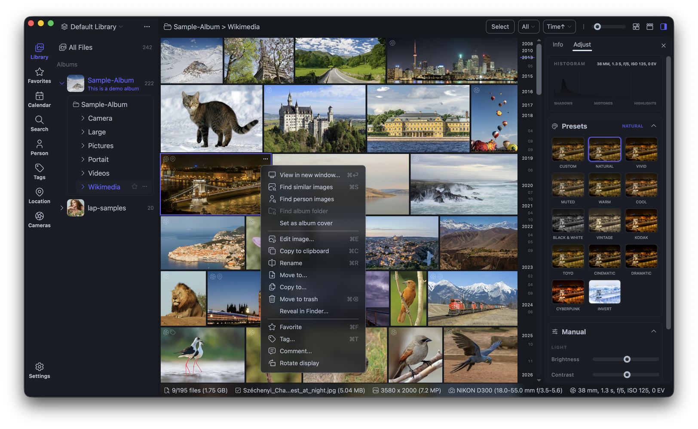
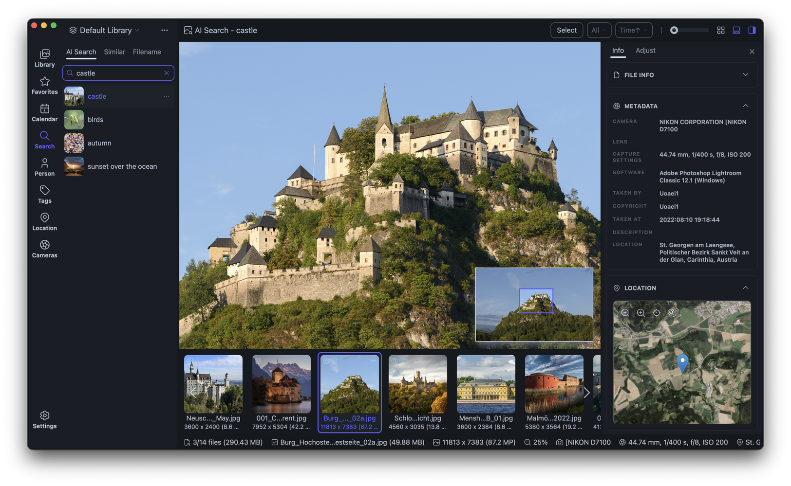

<div align="center">
  
  <h1>Lap</h1>
  <h3>Family-friendly, offline photo manager for 10k+ photos.</h3>
  <p>
    <a href="https://github.com/julyx10/lap/releases"></a>
    <a href="https://github.com/julyx10/lap/releases"></a>
    <a href="https://github.com/julyx10/lap/stargazers"></a>
    <a href="https://github.com/julyx10/lap/blob/main/LICENSE"></a>
  </p>
</div>

Lap was created by a photography enthusiast who couldn't find a truly satisfying photo manager on MacBook.
It is designed for two daily needs: organizing family albums and browsing/searching massive local photo libraries.

Website: [https://julyx10.github.io/lap/](https://julyx10.github.io/lap/)

Demo Video: [https://youtu.be/niMD1tTzS24](https://youtu.be/niMD1tTzS24)

## Core Highlights

- **Large-scale photo organization**: Built for family albums and photographer archives, with classification and search by **date, location, camera, and face recognition** across **10k+ photos**.
- **Multi-Library workflow**: Separate work and family libraries with clean boundaries and quick switching.
- **Local AI search**: Natural-language search, similar-image discovery, and face clustering run on-device for fast results.
- **Local folder management and sync**: No import required. Use your real folders directly; changes in Finder are reflected in Lap, and file moves in Lap stay synced on disk.
- **100% offline privacy**: No cloud upload, no remote processing, no vendor lock-in.

## Download

| Platform | Download | Notes |
| :-- | :-- | :-- |
| **macOS (Apple Silicon)** | [Download .dmg (aarch64)](https://github.com/julyx10/lap/releases/latest) | Notarized by Apple, fully tested |
| **macOS (Intel)** | [Download .dmg (x64)](https://github.com/julyx10/lap/releases/latest) | Notarized by Apple, not fully tested yet |
| **Linux (Ubuntu/Debian)** | [Download .deb (amd64)](https://github.com/julyx10/lap/releases/latest) | Community testing welcome |
| **Windows (x64)** | [Download .msi](https://github.com/julyx10/lap/releases/latest) | Tested on Windows 11 |

## Product Snapshot

<p align="center">
  
</p>

<p align="center">
  
</p>

> Notes: Screenshot sample images come from [Wikimedia Commons](https://commons.wikimedia.org/).

## Comparison

| Feature | Cloud Albums (Google/iCloud) | Classic Viewers | **Lap** |
| :--- | :---: | :---: | :---: |
| Privacy | ❌ | ✅ | ✅ |
| AI Search | ✅ | ❌ | ✅ |
| Folder-native file control | ❌ | ✅ | ✅ |
| Offline-first | ❌ | ✅ | ✅ |
| Vendor lock-in | High | None | None |

## Supported Formats

| Type | Formats |
| :--- | :--- |
| Images | JPG, PNG, GIF, BMP, TIFF, WebP, HEIC |
| Videos | MP4, MOV, MKV, WebM, AVI |

## Development

Tech stack:
- Core: [Tauri 2](https://tauri.app/) + Rust
- Frontend: Vue 3 + Vite
- Data: SQLite
- AI/media: CLIP, InsightFace, FFmpeg

Quick start:

```bash
# Download AI models
./scripts/download_models.sh

# Install frontend deps
cd src-vite && pnpm install && cd ..

# Run dev app
cargo tauri dev
```

Requirements:
- Node.js 20+, pnpm 8+
- Rust stable
- macOS: `xcode-select --install`, `brew install nasm pkg-config`
- Linux: `sudo apt install libwebkit2gtk-4.1-dev libappindicator3-dev librsvg2-dev patchelf nasm clang pkg-config`

## License

GPL-3.0-or-later. See [LICENSE](LICENSE).
