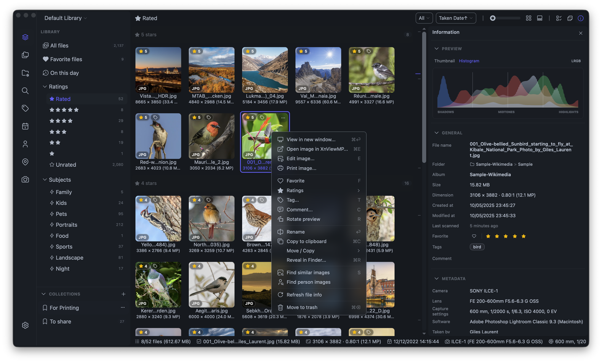

<div align="center">
  
  <h1>Lap - Gestionnaire de photos privées locales</h1>
  <h3>Gestionnaire de photos de bureau open source pour macOS, Windows et Linux.</h3>
  <p>
    <a href="https://github.com/julyx10/lap/releases"></a>
    <a href="https://github.com/julyx10/lap/releases"></a>
    <a href="https://github.com/julyx10/lap/stargazers"></a>
  </p>
</div>

[English](../README.md) | [Deutsch](README.de.md) | Français | [Español](README.es.md) | [Português](README.pt.md) | [Русский](README.ru.md) | [简体中文](README.zh-CN.md) | [日本語](README.ja.md) | [한국어](README.ko.md)

Lap est un gestionnaire de photos open source et local-first conçu pour parcourir les albums familiaux, retrouver rapidement d'anciennes photos et gérer de grandes bibliothèques multimédias personnelles hors ligne.
C'est une alternative respectueuse de la vie privée aux services de photos en ligne : pas de téléchargement forcé, recherche IA locale, flux de travail centré sur les dossiers, et gratuit à utiliser.

- Site web : [https://julyx10.github.io/lap/](https://julyx10.github.io/lap/)
- Vidéo de démonstration : [https://youtu.be/RbKqNKhbVUs](https://youtu.be/RbKqNKhbVUs)
- Confidentialité : [PRIVACY.md](../PRIVACY.md)

## Télécharger Lap

Ouvrez la [page des dernières versions](https://github.com/julyx10/lap/releases/latest), puis téléchargez le fichier correspondant à votre système :

| Plateforme | Paquet | Remarque |
| :-- | :-- | :-- |
| **macOS (Apple Silicon / Intel)** | `_aarch64.dmg` / `_x64.dmg` | Notarié par Apple |
| **Windows 10/11 (x64 / ARM64)** | `_x64_en-US.msi` / `_arm64_en-US.msi` | Non signé — si SmartScreen bloque le téléchargement, cliquez sur **Conserver quand même** |
| **Linux (amd64 / arm64)** | `_amd64.deb` / `_arm64.deb` | Pour les distributions basées sur Debian (Ubuntu, Debian, Linux Mint, etc.) |

### macOS avec Homebrew

```bash
brew tap julyx10/lap
brew install --cask lap
```

## Captures d'écran

<p align="center">
  
</p>

## Pourquoi Lap

- **Conçu en local-first** : vos photos restent sur votre propre disque, sans compte cloud ni téléversement obligatoire.
- **Pas de verrouillage de bibliothèque** : travaillez directement avec vos dossiers existants au lieu de tout importer dans une base de données fermée.
- **Outils d'IA privés** : recherche, similarité, tags intelligents et fonctions de visages s'exécutent localement sur votre machine.
- **Conçu pour les grandes collections** : optimisé pour parcourir et organiser des bibliothèques de plus de 100 000 fichiers.
- **Open source et gratuit** : pas d'abonnement, pas d'écosystème imposé, et un code que vous pouvez inspecter.

## Fonctionnalités

- **Navigation flexible dans la bibliothèque** avec filtres par chronologie, dossier, lieu, appareil photo, objectif, tag, favori, note, sujet et visage.
- **Albums intelligents** pour enregistrer des vues basées sur des règles, avec regroupement, tri et ordre personnalisés.
- **Plateau de collections** pour conserver des collections ponctuelles de fichiers sans les déplacer de leurs dossiers d'origine.
- **Recherche IA locale** pour les requêtes texte, la similarité visuelle, les sujets, le regroupement de visages et la recherche multilingue optionnelle dans plus de 50 langues.
- **Live Photos Apple** reconnaît les paires HEIC/MOV, les lit dans la visionneuse et conserve les fichiers associés MOV et AAE lors du renommage, du déplacement, de la copie et de la suppression.
- **Flux de travail centré sur les dossiers** avec plusieurs bibliothèques, import par glisser-déposer, import par copier-coller, synchronisation du système de fichiers et opérations sûres de déplacement/copie/suppression.
- **Outils de révision et de comparaison**, dont une visionneuse de comparaison d'images à quatre volets.
- **Outils de nettoyage** pour trouver les doublons et déplacer par lots les fichiers indésirables vers la corbeille.
- **Édition intégrée** pour recadrer, faire pivoter, retourner, redimensionner et appliquer des ajustements d'image de base.
- **Large prise en charge des formats** pour plus de 60 formats photo, RAW et vidéo.

## Désinstaller Lap

Lap utilise directement vos dossiers de photos existants. La désinstallation de Lap ou la suppression de ses fichiers de base de données et de cache ne supprime **pas** vos photos originales.

La désinstallation standard supprime l'application. Pour supprimer complètement Lap, quittez d'abord Lap, désinstallez l'application, puis supprimez la base de données locale, le cache des miniatures et les fichiers de configuration à l'aide des commandes correspondant à votre plateforme.

### macOS

Si vous avez installé Lap avec Homebrew :

```bash
brew uninstall --cask lap
```

Pour une installation manuelle, quittez Lap et déplacez `Lap.app` du dossier `Applications` vers la Corbeille.

Pour supprimer tous les fichiers de base de données, de cache et de configuration de Lap :

```bash
rm -rf "$HOME/Library/Application Support/com.julyx10.lap" \
       "$HOME/Library/Caches/com.julyx10.lap" \
       "$HOME/Library/WebKit/com.julyx10.lap"
rm -f "$HOME/Library/Preferences/com.julyx10.lap.plist"
```

### Windows

Ouvrez **Paramètres > Applications > Applications installées**, recherchez **Lap** et sélectionnez **Désinstaller**.

Ouvrez ensuite PowerShell et supprimez tous les fichiers de base de données, de cache et de configuration de Lap :

```powershell
Remove-Item -Recurse -Force -ErrorAction SilentlyContinue "$env:LOCALAPPDATA\com.julyx10.lap"
Remove-Item -Recurse -Force -ErrorAction SilentlyContinue "$env:APPDATA\com.julyx10.lap"
```

### Linux

Pour les distributions basées sur Debian, désinstallez le paquet :

```bash
sudo apt remove lap
```

Supprimez ensuite tous les fichiers de base de données, de cache et de configuration de Lap :

```bash
rm -rf "$HOME/.local/share/com.julyx10.lap" \
       "$HOME/.cache/com.julyx10.lap" \
       "$HOME/.config/com.julyx10.lap"
```

Si vous avez sélectionné un dossier de stockage personnalisé pour la base de données dans les paramètres de Lap, supprimez-le séparément après avoir vérifié qu'il contient uniquement des fichiers de base de données Lap.

## Compiler à partir des sources

Configuration requise : Node.js 20+, pnpm, Rust stable.

```bash
# Dépendances système macOS
xcode-select --install
brew install nasm pkg-config autoconf automake libtool cmake

# Dépendances système Linux
# sudo apt install libwebkit2gtk-4.1-dev libappindicator3-dev librsvg2-dev \
#   patchelf nasm clang pkg-config autoconf automake libtool cmake

# Cloner et compiler
git clone --recursive https://github.com/julyx10/lap.git
cd lap
git submodule update --init --recursive
cargo install tauri-cli --version "^2.0.0" --locked
./scripts/download_models.sh            # Windows: .\scripts\download_models.ps1
./scripts/download_ffmpeg_sidecar.sh    # Windows: .\scripts\download_ffmpeg_sidecar.ps1
cd src-vite && pnpm install && cd ..
cargo tauri dev
```

## Formats supportés

Lap prend en charge plus de 60 formats photo, RAW et vidéo.

| Type | Formats |
| :--- | :--- |
| Images | JPG/JPEG, PNG, GIF, BMP, TIFF, WebP, HEIC/HEIF/HIF, AVIF, JXL, PSD, EXR, HDR/RGBE, TGA, JPEG 2000 (JP2/J2K/J2C/JPC/JPF/JPX), DDS, DPX, QOI |
| Photos RAW | CR2, CR3, CRW, NEF, NRW, ARW, SRF, SR2, RAF, RW2, ORF, PEF, DNG, SRW, RWL, MRW, 3FR, MOS, DCR, KDC, ERF, MEF, RAW, MDC |
| Vidéos | MP4, MOV, M4V, MKV, AVI, FLV, TS/M2TS, WMV, WebM, 3GP/3G2, F4V, VOB, MPG/MPEG, ASF, DIVX et plus. La lecture H.264 est supportée sur toutes les plateformes, avec un traitement automatique de compatibilité lorsque la lecture native n'est pas disponible. HEVC/H.265 et VP9 sont supportés nativement sur macOS. |

### Note sur la lecture vidéo sous Linux

Sur Linux Mint/Ubuntu/Debian, installez ces paquets pour un meilleur support de la lecture vidéo :

```bash
sudo apt install gstreamer1.0-libav gstreamer1.0-plugins-good
```

## Architecture

- Cœur : Tauri + Rust
- Frontend : Vue + Vite + Tailwind CSS
- Données : SQLite

### Bibliothèques clés

| Bibliothèque | Usage |
| :-- | :-- |
| [LibRaw](https://github.com/LibRaw/LibRaw) | Décodage d'images RAW et extraction de miniatures |
| [libheif](https://github.com/strukturag/libheif) | Décodage d'images HEIC/HEIF/HIF et génération d'aperçus |
| [libjpeg-turbo](https://libjpeg-turbo.org/) | Décodage JPEG rapide et génération de miniatures |
| [FFmpeg](https://ffmpeg.org/) | Traitement vidéo et génération de miniatures |
| [Video.js](https://videojs.com/) | Interface de lecture vidéo multiplateforme |
| [ONNX Runtime](https://onnxruntime.ai/) | Moteur d'inférence de modèles d'IA local |
| [CLIP](https://github.com/openai/CLIP) | Recherche de similitude image-texte |
| [InsightFace](https://github.com/deepinsight/insightface) | Détection et reconnaissance faciale |
| [Leaflet](https://leafletjs.com/) | Carte interactive pour les photos géotaguées |
| [daisyUI](https://daisyui.com/) | Bibliothèque de composants UI |

## Licence

GPL-3.0-or-later. Voir [LICENSE](../LICENSE).
